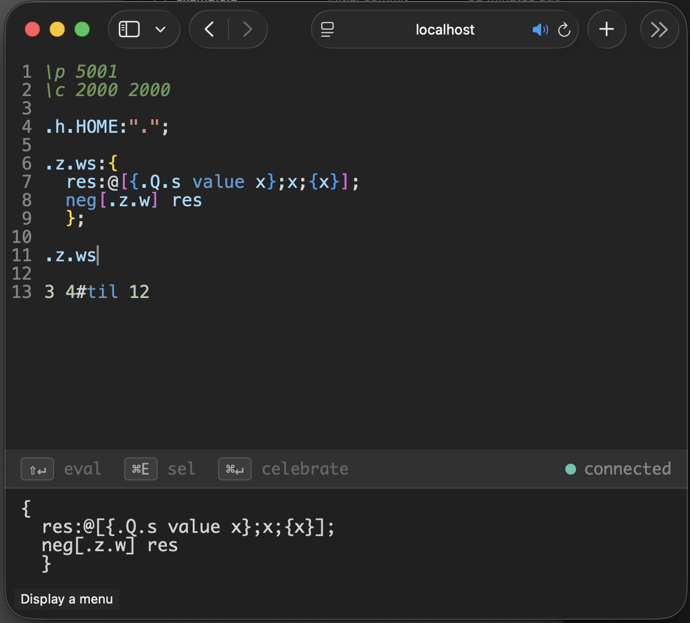

# qpad

A lightweight browser-based editor for q/kdb+. Write and execute q code directly in the browser with syntax highlighting, a live REPL, and a link to the reference docs.



## Features

- Syntax highlighting powered by CodeMirror 6
- Live evaluation via WebSocket — results appear inline below each expression
- Shift+click any builtin to open its kx reference docs in a new tab
- Single-file frontend (`editor.html`) — no build step

## Usage

Start a q process with the included server script:

```q
q editor.q
```

Then open `http://localhost:5001` in your browser.

## Requirements

- kdb+ (free [personal edition](https://kx.com/kdb-personal-edition-download/) works)
- A modern browser (Safari, Chrome, Firefox)
